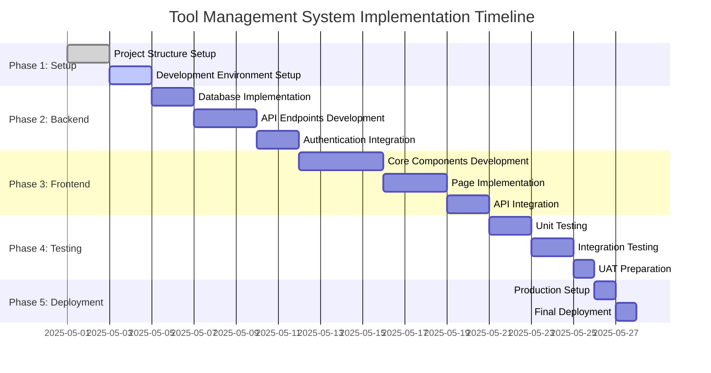

# Implementation Plan Timeline

## Project Timeline Overview

## Phase Breakdown

### Phase 1: Project Setup (May 1-4, 2025)
- **Tasks:**
  - Initialize project structure
  - Configure version control
  - Set up development environment
  - Install base dependencies
- **Deliverables:**
  - Complete project structure
  - Development environment ready

### Phase 2: Backend Development (May 5-11, 2025)
- **Tasks:**
  - Implement database schema
  - Develop API endpoints
  - Integrate authentication
  - Create service layer
- **Deliverables:**
  - Complete backend API
  - Database migration scripts
  - API documentation

### Phase 3: Frontend Development (May 12-19, 2025)
- **Tasks:**
  - Develop core components
  - Implement pages/routing
  - Integrate with backend API
  - Implement state management
- **Deliverables:**
  - Complete frontend application
  - Responsive UI components
  - API integration layer

### Phase 4: Testing (May 20-25, 2025)
- **Tasks:**
  - Write unit tests
  - Perform integration testing
  - Conduct user acceptance testing
  - Fix identified issues
- **Deliverables:**
  - Test suite completion
  - Bug fix report
  - UAT sign-off

### Phase 5: Deployment (May 26-27, 2025)
- **Tasks:**
  - Configure production environment
  - Deploy application
  - Final validation
  - Documentation completion
- **Deliverables:**
  - Production deployment
  - Final documentation
  - Project sign-off

## Key Milestones
- **Milestone 1:** Backend API Completion (May 11, 2025)
- **Milestone 2:** Frontend Components Completion (May 16, 2025)
- **Milestone 3:** Integration Completion (May 19, 2025)
- **Milestone 4:** Final Deployment (May 27, 2025)

## Resource Allocation
- **Team Structure:**
  - 2 Backend Developers
  - 2 Frontend Developers
  - 1 QA Engineer
  - 1 Project Manager

- **Tools:**
  - Git for version control
  - Docker for containerization
  - Postman for API testing
  - CI/CD pipeline for deployment

## Risk Management
- **Potential Risks:**
  - Scope creep
  - Integration challenges
  - Testing delays
  - Resource constraints

- **Mitigation Strategies:**
  - Regular sprint reviews
  - Continuous integration
  - Test-driven development
  - Resource contingency planning

## Success Criteria
- All requirements implemented
- 100% passing tests
- Successful user acceptance
- Complete documentation
- On-time delivery

Would you like me to:
1. Proceed with creating the final project documentation
2. Add more details about the CI/CD pipeline configuration
3. Or make any adjustments to this implementation plan?