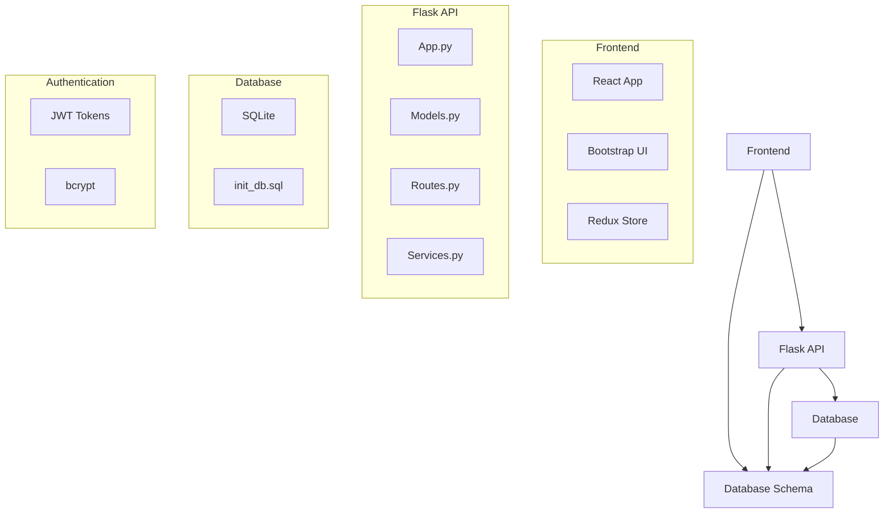

# Project Structure

## Overall Architecture


## Directory Structure
```
tool-management-system/
├── backend/
│   ├── app.py
│   ├── models.py
│   ├── routes.py
│   ├── services.py
│   ├── requirements.txt
│   └── config.py
├── frontend/
│   ├── public/
│   ├── src/
│   │   ├── components/
│   │   ├── services/
│   │   ├── store/
│   │   ├── App.js
│   │   └── index.js
│   ├── package.json
│   └── .env
├── database/
│   ├── init_db.sql
│   └── seed_data.sql
├── tests/
│   ├── backend/
│   └── frontend/
├── .gitignore
├── README.md
└── docker-compose.yml
```

## Key Components
### Backend (Flask)
- **app.py**: Main application entry point
- **models.py**: Database models (Tools, Users, Checkouts)
- **routes.py**: API endpoints
- **services.py**: Business logic
- **requirements.txt**: Dependencies (Flask, Flask-JWT, etc.)

### Frontend (React)
- **components/**: Reusable UI components
- **services/**: API client wrappers
- **store/**: Redux state management
- **App.js**: Main routing component
- **index.js**: Entry point

### Database
- **init_db.sql**: Schema creation script
- **seed_data.sql**: Initial data for testing

## Development Tools
- **Node.js**: Frontend development
- **Python 3.10+**: Backend development
- **SQLite**: Development database
- **Docker**: Containerization
- **Jest**: Testing framework

## Security Considerations
- JWT tokens for stateless authentication
- Password hashing with bcrypt
- Input validation middleware
- Rate limiting for API endpoints
- HTTPS in production

Would you like me to:
1. Proceed with creating the implementation plan timeline
2. Add more details about the authentication flow
3. Or make any adjustments to this project structure?