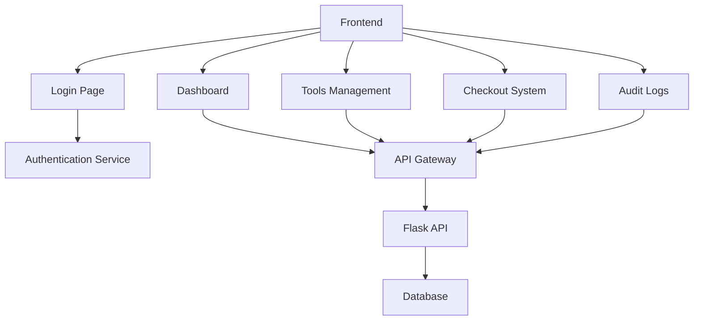

# SPA Frontend Design

## Architecture Overview


## Component Structure
### 1. Login Page
- Username/Employee Number field
- Password field
- Remember Me checkbox
- Login button
- Error display area

### 2. Dashboard
- Tool availability summary cards
- Recent checkouts timeline
- Quick action buttons (New Checkout, Add Tool)
- Navigation sidebar

### 3. Tools Management
- Tool list table with filters
- Tool details panel
- CRUD operations (Add/Edit/Delete)
- Export to CSV button

### 4. Checkout System
- Tool search/select dropdown
- User search/select dropdown
- Checkout date picker
- Return date field (auto-filled on return)
- Status indicator (Checked Out/Available)

### 5. Audit Logs
- Filter by date range
- Filter by action type
- Export to CSV button
- Detailed action view modal

## Technology Stack
- Framework: React.js with React Router
- Styling: Bootstrap 5 with custom theme
- State Management: Redux Toolkit
- API Client: Axios with interceptors
- Authentication: JWT tokens stored in localStorage

## Routing Structure
```jsx
<Route path="/" element={<ProtectedRoute><Dashboard /></ProtectedRoute>} />
<Route path="/login" element={<LoginPage />} />
<Route path="/tools" element={<ProtectedRoute><ToolsManagement /></ProtectedRoute>} />
<Route path="/checkouts" element={<ProtectedRoute><CheckoutSystem /></ProtectedRoute>} />
<Route path="/audit" element={<ProtectedRoute><AuditLogs /></ProtectedRoute>} />
<Route path="*" element={<NotFoundPage />} />
```

## API Integration
Each component will use service hooks to interact with the Flask API:
```javascript
// ToolService.js
const getTools = () => api.get('/tools');
const createTool = (tool) => api.post('/tools', tool);
const updateTool = (id, tool) => api.put(`/tools/${id}`, tool);
const deleteTool = (id) => api.delete(`/tools/${id}`);
```

Would you like me to:
1. Proceed with creating the project structure documentation
2. Add more details about the authentication flow
3. Or make any adjustments to this frontend design?